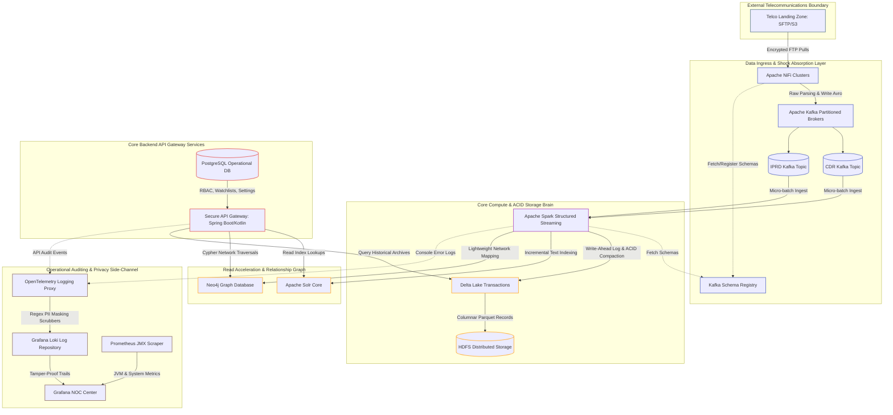
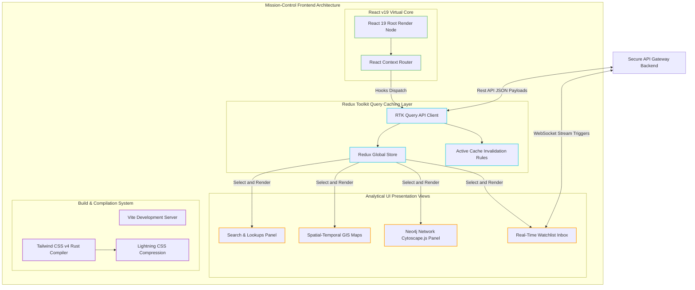

# System Architecture (HLD): Project Argus

This design layout directly leverages your custom stack. By utilizing **Delta Lake** on **HDFS** as the central storage engine, and branching into **Solr** and **Neo4j** for specialized query acceleration, you establish a solid architectural boundary.

Below is the initial system design blueprint, breaking down the exact strategic role, importance, and integration pattern for every tool in your project.

---

## 1. Data Ingestion & In-Flight Logistics

### Apache NiFi (The Border Gateway)

* **Strategic Importance:** Intelligence architectures must ingest non-stop file variations from diverse telecom clearinghouses. NiFi handles backpressure controls, encryption handshakes, and ingestion-edge delivery protocols natively.
* **Role in This Project:** NiFi sits at the perimeter of the agency network. It safely connects to telco SFTP servers, reads incoming stream folders, performs file corruption validations, and maps unstructured cellular logs into unified JSON objects before pushing them down the pipeline. Detailed edge file ingress flows and validation mechanics are specified in [Ingestion Layer Architecture](ingestion.md#2-ingress-protocols--apache-nifi-gateway).

### Apache Kafka (The Persistent Core Buffer)

* **Strategic Importance:** At a scale of 5 to 10 billion events daily, unexpected spikes can knock down distributed database endpoints. Kafka serves as an immutable, partitioned, shock-absorbing log queue.
* **Role in This Project:** It isolates your ingestion boundary from compute layers. NiFi serializes parsed records into Avro format and routes them to partitioned Kafka topics (`telecom.cdr.raw` and `isp.ipdr.raw`). This guarantees that even if downstream analytics jobs are processing massive heavy calculations, zero data packets are dropped at the intake edge. Detailed partitioning rules, topic properties, and durability standards are specified in [Ingestion Layer Architecture](ingestion.md#3-buffer-layer-apache-kafka-partitioning-strategy).

### Apache Schema Registry (The Schema Source of Truth)

* **Strategic Importance:** High-volume telemetry networks cannot afford the performance and storage overhead of verbose serialization formats like JSON. A Schema Registry allows the platform to use compact, binary serialization formats like Apache Avro or Protocol Buffers (Protobuf).
* **Role in This Project:** It acts as the central directory for storing, serving, and versioning data schemas. Apache NiFi queries the registry to serialize incoming records into Avro, and Apache Spark references it to dynamically retrieve schemas during consumer deserialization, enforcing strict data quality and backward compatibility.

---

## 2. Core Storage & Distributed Processing

### Apache Spark (The Distributed Compute Brain)

* **Strategic Importance:** Processing multi-terabyte data streams requires highly parallelized memory-mapped compute clusters rather than sequential CPU pipelines.
* **Role in This Project:** Spark handles both high-velocity structured streaming and massive periodic batch aggregations. It pulls messages continuously from Kafka partitions, performs structural sanitization, applies session-window logic (to group related user activities), and handles heavy analytical joins before updating the historical database.

### Delta Lake (The Transactional Accuracy Layer)

* **Strategic Importance:** Raw files written straight to distributed disk arrays often introduce metadata desynchronization, corrupted file states during crashes, and lack standard insert/update support.
* **Role in This Project:** Delta Lake provides an ACID transaction log right on top of your standard open-source disk arrays. It guarantees that Spark writes are all-or-nothing, tracks data layout metrics to optimize performance via data-skipping algorithms, and handles schema enforcement to catch corrupted fields before they hit long-term storage.

### HDFS (The Immutable Source-of-Truth Storage)

* **Strategic Importance:** Storing 5+ years of historical data demands an ultra-scalable file architecture that can run comfortably on highly available, cost-effective commodity server nodes.
* **Role in This Project:** HDFS serves as the raw physical repository. It stores compressed, columnar files generated by Delta Lake. By utilizing standard file replication policies across a distributed array, it ensures the agency has total fault-tolerance even if multiple compute rack systems fail concurrently.

---

## 3. Specialized Multi-Model Querying

### Apache Solr (The Multi-Column Multi-Field Index)

* **Strategic Importance:** Scanning through petabyte-scale data tables directly to answer a basic query (like searching for an individual IMSI) takes hours. Solr creates extremely fast text indices for instantaneous field matching.
* **Role in This Project:** Spark extracts indexing fields (such as phone numbers, device IDs, target IPs, and timestamps) and maps them into Solr collections. When an investigator searches for a cell-tower identifier, Solr returns matching primary-key lookups in fractions of a second, entirely bypassing heavy table scans on HDFS.

### Neo4j (The Network & Relationship Graph Engine)

* **Strategic Importance:** Traditional query systems require dozens of expensive JOIN queries to discover multi-degree relationships, completely crashing under big data loads. Neo4j treats entity links as physical memory pointers.
* **Role in This Project:** Neo4j stores only identity metadata nodes (such as phone numbers, MAC addresses, and specific SIM cards) along with the transactional edges connecting them (such as calls or shared data sessions). Analysts use Cypher query logic to trace complex communication chains and locate "burner phone" swaps across a massive network instantly.

### PostgreSQL (The Operational Meta-Database)

* **Strategic Importance:** Storing operational system metadata inside a big data framework adds unnecessary structural bulk and processing lag.
* **Role in This Project:** A secure, isolated PostgreSQL cluster manages application state variables, including role-based access profiles, user authorization keys, active target watchlists, analyst workspace configurations, and background operational auditing traces.

---

## 4. Mission-Control UI Engine

### React v19 + Redux (RTK Query) (The Analytical Interface)

* **Strategic Importance:** Intelligence dashboards must render rich geolocation tracks, dense tabular views, and network nodes concurrently without causing memory bottlenecks or interface lock-ups.
* **Role in This Project:** React 19 acts as the core interface layout manager. Redux Toolkit (RTK) Query manages back-end state synchronization, automatically deduplicating parallel server calls, caching large query responses, and stabilizing client-side tracking state maps when rendering massive connection structures.

### Tailwind CSS v4 + Vite (The Scalable Design & Build Layer)

* **Strategic Importance:** Large data applications require responsive, fast layouts that don't load down the browser with heavy, redundant stylesheet configurations.
* **Role in This Project:** Tailwind CSS v4 leverages a high-speed Rust compiler engine (via Lightning CSS) to process custom design choices natively inside CSS files. Combined with Vite's immediate compilation architecture, your developers get ultra-fast hot-reloading while building intensive dashboard mapping modules.


## 5. Security & System Observability

### Prometheus & Grafana (The System Health Watchdogs)

* **Strategic Importance:** Running an intensive, multi-layered data pipeline requires deep, continuous visibility to identify ingestion delays or cluster bottlenecks instantly.
* **Role in This Project:** All Java-based backend instances (Kafka, Spark, NiFi, Solr, HDFS, Neo4j) stream performance metrics into Prometheus via JMX exporters. Grafana unifies these infrastructure metrics into operational dashboards, tracking ingestion backpressure, executor RAM usage, and target alerting latency.

### OpenTelemetry Collector + Grafana Loki (The Privacy Guardrail)

* **Strategic Importance:** Security regulations require that zero production PII leaks out into development monitoring backends via unexpected error dumps or debugging logs.
* **Role in This Project:** Loki aggregates system logs without indexing sensitive message contexts. Every node running a production service includes a localized OpenTelemetry proxy. This collector scrubs log messages using real-time regex matching before transmission, automatically stripping real telephone numbers, IMSIs, and IP addresses, substituting them with secure masking labels.

### Synthetic Data Sandbox (The Air-Gapped Sandbox Strategy)

* **Strategic Importance:** Developers do not require access to live agency metadata to build robust tools; they need structurally representative, realistic data relationships.
* **Role in This Project:** A dedicated Spark generator script populates your development and testing sandboxes with artificial data matching the production schema. This ensures engineering teams can benchmark Solr lookups and validate Neo4j graph algorithms against millions of rows without exposing sensitive production records.

---


## Architecture Topology Maps

To ensure clarity across development teams, the system architecture is separated into a high-scale, multi-model backend data pipeline and a responsive, state-synchronized analyst frontend console. Both designs leverage border-stroke groupings to support high contrast across light and dark rendering themes.

### 1. Detailed Backend Architecture

The backend pipeline handles high-throughput stream ingestion, distributed compute aggregations, dual specialized indexing projections, secure API routing, and regex-based PII log sanitization.



### 2. Detailed Frontend Architecture

The analyst user interface utilizes React 19 as its core presentation layer, driven by Redux Toolkit Query for automated REST/WebSocket API caching and UI synchronization.




## Structural Pipeline Walkthrough

### 1. Ingestion Isolation

The interface connection between external telecommunication networks and internal systems terminates at **Apache NiFi**. Raw call records and data session dumps never float loosely inside our storage tiers; they pass through NiFi directly into partitioned **Apache Kafka** pipelines. Kafka guarantees that if internal cluster nodes experience transient processing delays, the external network ingestion state remains intact.

### 2. Dual Projection Strategy

Instead of executing complex target lookups against our main storage array, **Apache Spark** continuously coordinates a dual-projection system:

* **Search Indices:** Spark updates **Apache Solr** with key tracking terms (such as device IDs, dynamic IP addresses, and timestamps). When investigators seek specific targets, Solr returns indexed data pointers instantly, avoiding multi-hour database sweeps.
* **Graph Relationships:** Spark strips away contextual text details and writes pure connection identities into **Neo4j**. This lightweight configuration maps complex tracking patterns and communication linkages efficiently without placing heavy demands on system memory.

### 3. Log Scrubbing Pipeline

To maintain data privacy, production worker engines do not broadcast raw logging streams directly to storage. Applications output console messages straight through a localized **OpenTelemetry Collector**. The collector evaluates log lines using inline regex patterns, replacing specific identifiers (such as phone numbers and IP addresses) with secure placeholders before transmitting the information to **Grafana Loki**.

### 4. Sandbox Air-Gap

Development teams operate inside an entirely separate, non-production ecosystem. Engineers write code logic, tweak query profiles, and adjust search mechanics against an isolated container environment seeded by a specialized **Synthetic Data Generator**. This setup allows the engineering team to optimize data flows and stress-test pipeline components without accessing production data.

---

## 6. Core Raw Data Schemas

To facilitate development inside the engineering sandbox, below are the formal JSON data schemas expected by the ingestion pipeline. The **Synthetic Data Generator** produces mock structures adhering to these models.

### 6.1 Call Detail Record (CDR) Schema
Representing voice and SMS telecommunication events captured at the network edge.

```json
{
  "$schema": "https://json-schema.org/draft/2020-12/schema",
  "title": "CallDetailRecord",
  "type": "object",
  "properties": {
    "event_id": {
      "type": "string",
      "format": "uuid",
      "description": "Unique identifier generated by Apache NiFi upon ingestion."
    },
    "timestamp": {
      "type": "string",
      "format": "date-time",
      "description": "UTC timestamp of event commencement."
    },
    "imsi": {
      "type": "string",
      "pattern": "^[0-9]{15}$",
      "description": "International Mobile Subscriber Identity (SIM card identifier)."
    },
    "imei": {
      "type": "string",
      "pattern": "^[0-9]{15}$",
      "description": "International Mobile Equipment Identity (Physical device hardware ID)."
    },
    "msisdn": {
      "type": "string",
      "description": "Dialable telephone number of the subscriber in E.164 format."
    },
    "call_type": {
      "type": "string",
      "enum": ["VOICE", "SMS"],
      "description": "The category of communication."
    },
    "direction": {
      "type": "string",
      "enum": ["INCOMING", "OUTGOING"],
      "description": "Direction relative to the target subscriber."
    },
    "other_party_msisdn": {
      "type": "string",
      "description": "Telephone number of the remote conversing party."
    },
    "duration_seconds": {
      "type": ["integer", "null"],
      "minimum": 0,
      "description": "Duration of call in seconds. Must be null if call_type is SMS."
    },
    "cell_tower_id": {
      "type": "string",
      "description": "Alphanumeric cell site identifier tracking location coordinates."
    },
    "lac": {
      "type": "string",
      "description": "Location Area Code grouping towers."
    }
  },
  "required": [
    "event_id",
    "timestamp",
    "imsi",
    "imei",
    "msisdn",
    "call_type",
    "direction",
    "other_party_msisdn",
    "cell_tower_id"
  ]
}
```

### 6.2 IP Detail Record (IPRD) Schema
Representing dynamic IP allocation leases and traffic routing actions captured at broadband core gateways.

```json
{
  "$schema": "https://json-schema.org/draft/2020-12/schema",
  "title": "IPDetailRecord",
  "type": "object",
  "properties": {
    "event_id": {
      "type": "string",
      "format": "uuid",
      "description": "Unique identifier generated by Apache NiFi."
    },
    "timestamp": {
      "type": "string",
      "format": "date-time",
      "description": "UTC timestamp of the network session initialization."
    },
    "imsi": {
      "type": "string",
      "pattern": "^[0-9]{15}$",
      "description": "IMSI mapping the leased IP to a physical cellular subscriber."
    },
    "msisdn": {
      "type": "string",
      "description": "Subscriber telephone number."
    },
    "session_id": {
      "type": "string",
      "description": "Lease session token tracking connection persistence."
    },
    "allocated_ip": {
      "type": "string",
      "oneOf": [
        { "format": "ipv4" },
        { "format": "ipv6" }
      ],
      "description": "Dynamic IP address allocated to the subscriber."
    },
    "destination_ip": {
      "type": "string",
      "oneOf": [
        { "format": "ipv4" },
        { "format": "ipv6" }
      ],
      "description": "Remote destination IP accessed by the target subscriber."
    },
    "source_port": {
      "type": "integer",
      "minimum": 1,
      "maximum": 65535,
      "description": "Local source egress port."
    },
    "destination_port": {
      "type": "integer",
      "minimum": 1,
      "maximum": 65535,
      "description": "Target ingress port."
    },
    "protocol": {
      "type": "string",
      "enum": ["TCP", "UDP"],
      "description": "Transport layer protocol used."
    },
    "data_volume_bytes": {
      "type": "integer",
      "minimum": 0,
      "description": "Total bytes transferred during the session window."
    }
  },
  "required": [
    "event_id",
    "timestamp",
    "imsi",
    "msisdn",
    "session_id",
    "allocated_ip",
    "destination_ip",
    "source_port",
    "destination_port",
    "protocol",
    "data_volume_bytes"
  ]
}
```


