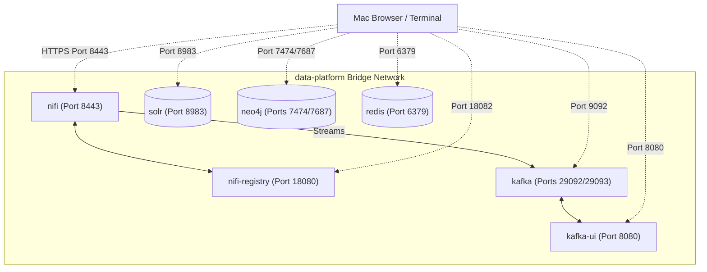

# Local Development Sandbox Setup Guide

This guide describes how to run and verify the local development infrastructure for **Project Argus**. This environment hosts the entire specialized ingestion, caching, and multi-model database suite under a single, isolated Docker network using modern, Zookeeper-free **KRaft (Kafka Raft) metadata mode**.

---

## 🏛️ Architecture Overview

The local infrastructure consists of seven primary containers connected via the `data-platform` bridge network. This setup guarantees immediate service-to-service hostname resolution while exposing ports cleanly on your local Mac localhost.



---

## 🔑 Infrastructure Directory & Credentials

Below is the routing table and configuration reference for accessing the sandbox services from both inside the container network and from your Mac terminal/browser:

| Service | Internal URL (Bridge Net) | External URL (Your Mac) | Credentials | Purpose / Tool Role |
| :--- | :--- | :--- | :--- | :--- |
| **Apache NiFi** | `nifi:8443` | `https://localhost:8443` | `admin` / `argus-nifi-password-1234` | Edge files listing, ingestion, and parsing gateway. |
| **NiFi Registry**| `nifi-registry:18080`| `http://localhost:18082` | Anonymous (No Auth) | **GitOps Version Control** for your dataflow pipelines. |
| **Apache Kafka** | `kafka:29092` | `localhost:9092` | Anonymous (No Auth) | High-speed ingestion persistent buffer. |
| **Kafka UI** | *N/A* | `http://localhost:8080` | Anonymous (No Auth) | Visualizer for topics, groups, and payloads. |
| **Redis Cache** | `redis:6379` | `localhost:6379` | Anonymous (No Auth) | Sub-millisecond session state and target tracking cache. |
| **Apache Solr** | `solr:8983` | `http://localhost:8983` | Anonymous (No Auth) | Text index and header search engine. |
| **Neo4j Graph** | `neo4j:7687` (Bolt) | `localhost:7687` (Bolt) | `neo4j` / `argus-local-dev-password` | Entity relationship correlation. |
| **Neo4j Console**| *N/A* | `http://localhost:7474` | `neo4j` / `argus-local-dev-password` | Interactive Cypher query dashboard. |

> [!IMPORTANT]
> * **NiFi Password Rule:** Apache NiFi requires a minimum credential password length of **12 characters**. Do not shorten `argus-nifi-password-1234` in your configs.
> * **Neo4j APOC:** The Neo4j community container is preconfigured with the **APOC (Awesome Procedures on Cypher)** plugin, essential for spatial, temporal, and pathfinding queries. Security settings have been hardened in `docker-compose.yml` to allow unrestricted execution of APOC modules.

---

## 🚀 Orchestration Commands

Ensure you have **Docker Desktop** running on your Mac before launching the stack.

### 1. Launching the Sandbox
To spin up all services in the background:
```bash
docker compose up -d
```

### 2. Monitoring Container Status
Verify that all services have successfully transitioned to a running and healthy state:
```bash
docker compose ps
```

### 3. Reviewing Live Logs
To tail system stdout/stderr streams across all services:
```bash
docker compose logs -f
```
Or for a specific container (e.g., NiFi Registry):
```bash
docker compose logs -f nifi-registry
```

### 4. Stopping and Cleaning
To pause the containers without losing your persisted states and search indexes:
```bash
docker compose stop
```
To tear down the containers completely (keeping your volume data intact):
```bash
docker compose down
```
To wipe all state entirely and start with a blank slate (deletes persisted named volumes):
```bash
docker compose down -v
```

---

## 💾 GitOps: Official Flow Version Control Tutorial

Integrating **Apache NiFi** with **NiFi Registry** establishes the official enterprise GitOps pipeline. This allows you to track, commit, version, and share your flows natively without manually dealing with JSON files in directories.

Follow this one-time configuration sequence to link NiFi to the Registry:

### Step 1: Create a Bucket in NiFi Registry
1. Open **[http://localhost:18082/nifi-registry](http://localhost:18082/nifi-registry)** in your web browser.
2. Click the **Settings (wrench) icon** in the top right.
3. Click the **"New Bucket"** button.
4. Name the bucket **`Argus Ingestion`** and click **Create**.

---

### Step 2: Register the Client inside Apache NiFi
1. Open **[https://localhost:8443/nifi](https://localhost:8443/nifi)** in your web browser and log in.
2. Click the **Hamburger menu icon (☰)** in the top right corner and select **Controller Settings**.
3. Go to the **Registry Clients** tab.
4. Click the **`+`** (Add) icon.
5. Configure the Registry Client popup:
   * **Name:** `Local Registry`
   * **Client Type:** `NiFi Registry`
   * **URL:** **`http://nifi-registry:18080`** *(Important: Always use the internal bridge network container name!)*
6. Click **Add** and close the settings panel.

---

### Step 3: Start Version Control on Your Canvas
Now you can version control any Process Group (including the one you imported!):
1. **Drag your Process Group** onto the canvas (or import `conf/nifi/NiFi_Flow.json` once as described below).
2. Right-click the **Process Group boundary box** on your canvas.
3. Hover over **Version Control** and click **Start Version Control**.
4. Configure the check-in parameters:
   * **Registry Client:** Select `Local Registry` (automatically populated).
   * **Bucket:** Select `Argus Ingestion` (automatically populated).
   * **Flow Name:** `Argus Telemetry Stream`
5. Click **Save**.

Your Process Group will now show a **green checkmark icon** on the canvas, indicating it is officially in version control! 

*   *Whenever you make changes, simply right-click the group, go to **Version Control**, and click **Commit Local Changes** to save a new declarative version instantly.*

---

## 🔬 In-Sandbox Verification & Health Checks

Once the containers are running, you can execute these simple terminal tests to ensure that our specialized streaming and database projections are fully functional.

### 1. Apache NiFi Ingress Check
Verify that the edge border gateway is up and serving secure administrative channels:
```bash
curl -k -I https://localhost:8443/nifi
```
*(Expected: HTTP `200 OK` or `302 Found` directing to login).*

### 2. NiFi Registry Health Check
Confirm the Registry is listening and serving clean metadata:
```bash
curl -I http://localhost:18082/nifi-registry
```
*(Expected: HTTP `200 OK`).*

### 3. Apache Kafka Ingestion Check
You can test topic creations and message broadcasts directly from your Mac command line.

* **Create a Test Ingestion Topic**:
  ```bash
  docker exec -it kafka kafka-topics --create \
    --bootstrap-server localhost:9092 \
    --replication-factor 1 \
    --partitions 3 \
    --topic telecom.cdr.raw.test
  ```

* **Verify Topic Properties**:
  ```bash
  docker exec -it kafka kafka-topics --describe \
    --bootstrap-server localhost:9092 \
    --topic telecom.cdr.raw.test
  ```

* **Visualize in Kafka UI**:
  Open [http://localhost:8080](http://localhost:8080) in your web browser. You should see the cluster `local-kraft` active with your newly created topic.

### 4. Redis State Cache Check
Ensure the in-memory cache responds instantly to programmatic audits:
```bash
docker exec -it redis redis-cli ping
```
*(Expected: `PONG`).*

### 5. Apache Solr Index Check
Ensure the Solr core engine can respond to diagnostic API calls.
```bash
curl -s http://localhost:8983/solr/admin/info/system | grep solr_home
```

### 6. Neo4j Graph Database Check
Verify Bolt connectivity and confirm APOC execution algorithms:
```bash
curl -I http://localhost:7474
```
Open [http://localhost:7474](http://localhost:7474), log in with `neo4j / argus-local-dev-password`, and execute:
```cypher
RETURN apoc.version() AS apoc_version;
```

---

## 🛠️ Sandbox Troubleshooting & Diagnostics

If one or more containers (e.g. **Neo4j** or **Solr**) are not coming up, run through the following diagnosis steps to locate and resolve the issue.

### Step 1: Inspect Container Startup Logs
If a container fails to start, the Docker logs will tell you the exact java exception or permission lock:
```bash
# Check Neo4j error stack
docker logs neo4j

# Check Solr error stack
docker logs solr
```

### Step 2: Diagnose Port Collisions on Your Mac
If you are already running local instances of Neo4j, Redis, or Apache Solr natively on your MacBook, the Docker container will crash because its host port is already bound.
To identify what is blocking the ports, run:
```bash
# Check if Neo4j ports are blocked
lsof -i :7474
lsof -i :7687

# Check if Apache Solr port is blocked
lsof -i :8983

# Check if Apache NiFi port is blocked
lsof -i :8443

# Check if NiFi Registry port is blocked
lsof -i :18082
```
* **Solution:** If a conflict exists, stop the native service on your Mac, or change the exposed host port in `.env` (e.g. mapping `SOLR_PORT=8984` or `NIFI_REGISTRY_PORT=18081`).

### Step 3: Solve Neo4j APOC Net Outage Crashes
When Neo4j first boots, it attempts to download the APOC library from Neo4j servers. If your Mac is offline or behind a strict firewall/VPN, the download fails and the container halts.
* **Solution (Offline Mode):** If you have no internet access during startup, you can temporarily disable the plugin downloader by commenting out the `NEO4J_PLUGINS` line in your `docker-compose.yml`:
  ```yaml
  # NEO4J_PLUGINS: '["apoc"]'
  ```

---

## 📡 Microservice Connectivity

When building or running future components of Project Argus (such as Apache Spark streaming jobs or Spring Boot API gateways) on your local Mac, they can connect to the sandbox using one of two methods:

### Option A: Running Inside the Docker Network (Recommended)
If your application is dockerized, add it to the same network in its `docker-compose.yml`:
```yaml
networks:
  default:
    external:
      name: data-platform
```
Configure your application’s property bindings to resolve container names directly:
* **NiFi HTTPS Link**: `https://nifi:8443`
* **NiFi Registry**: `http://nifi-registry:18080`
* **Kafka Bootstraps**: `kafka:29092`
* **Redis Host**: `redis:6379`
* **Solr Endpoint**: `http://solr:8983/solr`
* **Neo4j URI**: `bolt://neo4j:7687`

### Option B: Running Natively on Your Mac Host
If running application binaries directly on macOS:
* **NiFi HTTPS Link**: `https://localhost:8443`
* **NiFi Registry**: `http://localhost:18082`
* **Kafka Bootstraps**: `localhost:9092`
* **Redis Host**: `localhost:6379`
* **Solr Endpoint**: `http://localhost:8983/solr`
* **Neo4j URI**: `bolt://localhost:7687`
