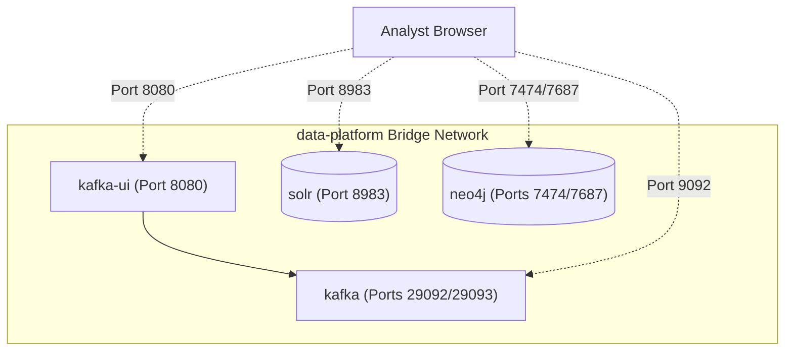

# Local Development Sandbox Setup Guide

This guide describes how to run and verify the local development infrastructure for **Project Argus**. This environment hosts the entire specialized ingestion and multi-model database suite under a single, isolated Docker network using modern, Zookeeper-free **KRaft (Kafka Raft) metadata mode**.

---

## 🏛️ Architecture Overview

The local infrastructure consists of four primary containers connected via the `data-platform` bridge network. This setup guarantees immediate service-to-service hostname resolution while exposing ports cleanly on your local Mac localhost.



---

## 🔑 Infrastructure Directory & Credentials

Below is the routing table and configuration reference for accessing the sandbox services from both inside the container network and from your Mac terminal/browser:

| Service | Internal URL (Bridge Net) | External URL (Your Mac) | Credentials | Purpose / Tool Role |
| :--- | :--- | :--- | :--- | :--- |
| **Apache Kafka** | `kafka:29092` | `localhost:9092` | Anonymous (No Auth) | High-speed ingestion persistent buffer. |
| **Kafka UI** | *N/A* | `http://localhost:8080` | Anonymous (No Auth) | Visualizer for topics, groups, and payloads. |
| **Apache Solr** | `solr:8983` | `http://localhost:8983` | Anonymous (No Auth) | Text index and header search engine. |
| **Neo4j Graph** | `neo4j:7687` (Bolt) | `localhost:7687` (Bolt) | `neo4j` / `argus-local-dev-password` | Entity relationship correlation. |
| **Neo4j Console**| *N/A* | `http://localhost:7474` | `neo4j` / `argus-local-dev-password` | Interactive Cypher query dashboard. |

> [!IMPORTANT]
> The Neo4j community container in this sandbox is preconfigured with the **APOC (Awesome Procedures on Cypher)** plugin, which is essential for running the spatial, temporal, and pathfinding queries detailed in [Features & Capabilities](features.md#cytoscapejs-network-graphs).

---

## 🚀 Orchestration Commands

Ensure you have **Docker Desktop** running on your Mac before launching the stack.

### 1. Launching the Sandbox
To spin up all services in the background:
```bash
docker compose up -d
```

### 2. Monitoring Container Status
Verify that all services have successfully transitioned to a running and healthy state:
```bash
docker compose ps
```

### 3. Reviewing Live Logs
To tail system stdout/stderr streams across all services:
```bash
docker compose logs -f
```
Or for a specific container (e.g., Kafka):
```bash
docker compose logs -f kafka
```

### 4. Stopping and Cleaning
To pause the containers without losing your persisted graph relationships and search indexes:
```bash
docker compose stop
```
To tear down the containers completely (keeping your volume data intact):
```bash
docker compose down
```
To wipe all state entirely and start with a blank slate (deletes persisted named volumes):
```bash
docker compose down -v
```

---

## 🔬 In-Sandbox Verification & Health Checks

Once the containers are running, you can execute these simple terminal tests to ensure that our specialized streaming and database projections are fully functional.

### 1. Apache Kafka Ingestion Check
You can test topic creations and message broadcasts directly from your Mac command line.

* **Create a Test Ingestion Topic**:
  ```bash
  docker exec -it kafka kafka-topics --create \
    --bootstrap-server localhost:9092 \
    --replication-factor 1 \
    --partitions 3 \
    --topic telecom.cdr.raw.test
  ```

* **Verify Topic Properties**:
  ```bash
  docker exec -it kafka kafka-topics --describe \
    --bootstrap-server localhost:9092 \
    --topic telecom.cdr.raw.test
  ```

* **Visualize in Kafka UI**:
  Open [http://localhost:8080](http://localhost:8080) in your web browser. You should see the cluster `local-kraft` active with your newly created topic, partition offsets, and message counts completely visible.

---

### 2. Apache Solr Index Check
Ensure the Solr core engine can respond to diagnostic API calls.

* **Query Solr System Info**:
  ```bash
  curl -s http://localhost:8983/solr/admin/info/system | grep solr_home
  ```

* **Verify Solr Administration Console**:
  Navigate to [http://localhost:8983](http://localhost:8983) to verify core metrics, heap distributions, and active document indexing logs.

---

### 3. Neo4j Graph Database Check
Verify Bolt connectivity and confirm APOC execution algorithms.

* **Verify Database Status via HTTP**:
  ```bash
  curl -I http://localhost:7474
  ```

* **Execute Cypher & APOC Test Query**:
  Open the Neo4j Web UI at [http://localhost:7474](http://localhost:7474), log in with the credentials `neo4j / argus-local-dev-password`, and execute this test query in the command prompt to verify APOC version integrity:
  ```cypher
  RETURN apoc.version() AS apoc_version;
  ```

---

## 📡 Microservice Connectivity

When building or running future components of Project Argus (such as Apache Spark streaming jobs or Spring Boot API gateways) on your local Mac, they can connect to the sandbox using one of two methods:

### Option A: Running Inside the Docker Network (Recommended)
If your application is dockerized, add it to the same network in its `docker-compose.yml`:
```yaml
networks:
  default:
    external:
      name: data-platform
```
Configure your application’s property bindings to resolve container names directly:
* **Kafka Bootstraps**: `kafka:29092`
* **Solr Endpoint**: `http://solr:8983/solr`
* **Neo4j URI**: `bolt://neo4j:7687`

### Option B: Running Natively on Your Mac Host
If running application binaries directly on macOS:
* **Kafka Bootstraps**: `localhost:9092`
* **Solr Endpoint**: `http://localhost:8983/solr`
* **Neo4j URI**: `bolt://localhost:7687`


# Implementation Plan: Zookeeper-Free Local Infrastructure (KRaft & Docker Compose)

This updated implementation plan eliminates the deprecated Apache ZooKeeper dependency in favor of **KRaft (Kafka Raft) metadata mode**. Running in KRaft mode substantially reduces local memory overhead (crucial for local laptop environments like macOS), accelerates start-up times, and aligns our setup with the modern production standards of Apache Kafka.

We will orchestrate **Kafka**, **Kafka UI**, **Apache Solr**, and **Neo4j** under a unified, isolated bridge network (`data-platform`).

---

## 🏛️ Strategic Goals

1. **Modern ZooKeeper-Free Setup**: Configure Apache Kafka in KRaft mode, acting as both broker and controller in a single container.
2. **Integrated Service Mesh**: Host all services in a single Docker bridge network (`data-platform`) enabling native container DNS lookup.
3. **Persisted Volumes**: Maintain Solr indices and Neo4j graph nodes across container lifetimes using isolated Docker named volumes.
4. **Optimized Local footprint**: Maximize system resource availability by dropping Zookeeper, and defining custom lightweight memory boundaries where appropriate.

---

## 📂 Proposed Changes

We will introduce the following files into the repository root:
1. `docker-compose.yml` - Multi-container setup utilizing KRaft and specialized databases.
2. `.gitignore` - Standard project ignore profiles.

---

### 1. Multi-Container Orchestration

#### [NEW] [docker-compose.yml](file:///Users/ervijay/Documents/Programs/Repo/argus/docker-compose.yml)

We will define 4 interconnected services running on the `data-platform` bridge network:


##### A. Ingestion Buffer (KRaft Kafka Stack)
* **`kafka`**: The core data shock-absorber, configured in Zookeeper-free KRaft mode.
  * **Image**: `confluentinc/cp-kafka:7.6.0`
  * **Ports**: `9092:9092` (Host-level ingress)
  * **Environment**:
    * `KAFKA_NODE_ID: 1`
    * `KAFKA_PROCESS_ROLES: 'broker,controller'`
    * `KAFKA_CONTROLLER_QUORUM_VOTERS: '1@kafka:29093'`
    * `KAFKA_LISTENERS: 'PLAINTEXT://0.0.0.0:29092,CONTROLLER://0.0.0.0:29093,PLAINTEXT_HOST://0.0.0.0:9092'`
    * `KAFKA_ADVERTISED_LISTENERS: 'PLAINTEXT://kafka:29092,PLAINTEXT_HOST://localhost:9092'`
    * `KAFKA_LISTENER_SECURITY_PROTOCOL_MAP: 'CONTROLLER:PLAINTEXT,PLAINTEXT:PLAINTEXT,PLAINTEXT_HOST:PLAINTEXT'`
    * `KAFKA_CONTROLLER_LISTENER_NAMES: 'CONTROLLER'`
    * `KAFKA_INTER_BROKER_LISTENER_NAME: 'PLAINTEXT'`
    * `KAFKA_OFFSETS_TOPIC_REPLICATION_FACTOR: 1`
    * `CLUSTER_ID: '4L62xNx2Tda6nvSI7mD5dA'` (A predefined, standard base64 UUID for local KRaft metadata initiation).
* **`kafka-ui`**: Topic and cluster visualization controller.
  * **Image**: `provectuslabs/kafka-ui:latest`
  * **Ports**: `8080:8080`
  * **Environment**:
    * `KAFKA_CLUSTERS_0_NAME: local-kraft`
    * `KAFKA_CLUSTERS_0_BOOTSTRAPSERVERS: kafka:29092` (Resolves broker natively within the bridge network).

##### B. Database Stack
* **`solr`**: Columnar search engine index.
  * **Image**: `solr:9`
  * **Ports**: `8983:8983`
  * **Volumes**: `solr_data:/var/solr` (Persistent volume mount)
  * **Healthcheck**: `curl -f http://localhost:8983/solr/admin/info/system`
* **`neo4j`**: Native relationship graph engine.
  * **Image**: `neo4j:5-community`
  * **Ports**: `7474:7474` (HTTP), `7687:7687` (Bolt binary link)
  * **Volumes**:
    * `neo4j_data:/data` (Persisted database state)
    * `neo4j_logs:/logs`
    * `neo4j_import:/var/lib/neo4j/import`
  * **Environment**: `NEO4J_AUTH=neo4j/argus-local-dev-password` and `NEO4J_PLUGINS=["apoc"]`
  * **Healthcheck**: Cypher evaluation verification `RETURN 1` via `cypher-shell`.

---

### 2. Workspace Hygiene

#### [NEW] [.gitignore](file:///Users/ervijay/Documents/Programs/Repo/argus/.gitignore)
* Ignore `.DS_Store` and standard local environment lock files.
* Ensure local developer host directories for binds (if any) are kept out of active git commits.

---

## 🔬 Verification Plan

We will boot and test the entire container stack using terminal verification commands.

### Automated Verification
After running `docker compose up -d`, we will execute:
1. `docker compose ps` to verify all 4 containers (`kafka`, `kafka-ui`, `solr`, `neo4j`) are in a healthy running state.
2. Direct connection endpoints health audits:
   * **Kafka-UI**: `curl -I http://localhost:8080`
   * **Solr Console**: `curl -I http://localhost:8983/solr/`
   * **Neo4j Console**: `curl -I http://localhost:7474`

### Manual Verification
Verify UI dashboard and console integrity:
* Open Kafka UI at [http://localhost:8080](http://localhost:8080) to inspect the active KRaft cluster metadata.
* Open Neo4j console at [http://localhost:7474](http://localhost:7474) and login using `neo4j` and `argus-local-dev-password`.
* Access Solr admin screen at [http://localhost:8983](http://localhost:8983).
